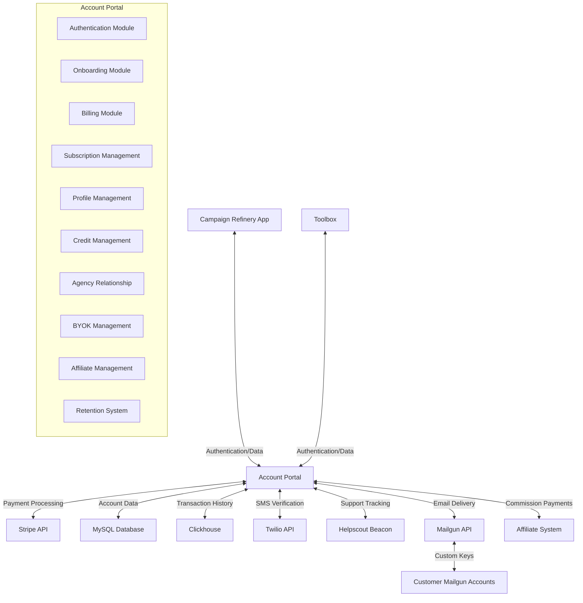
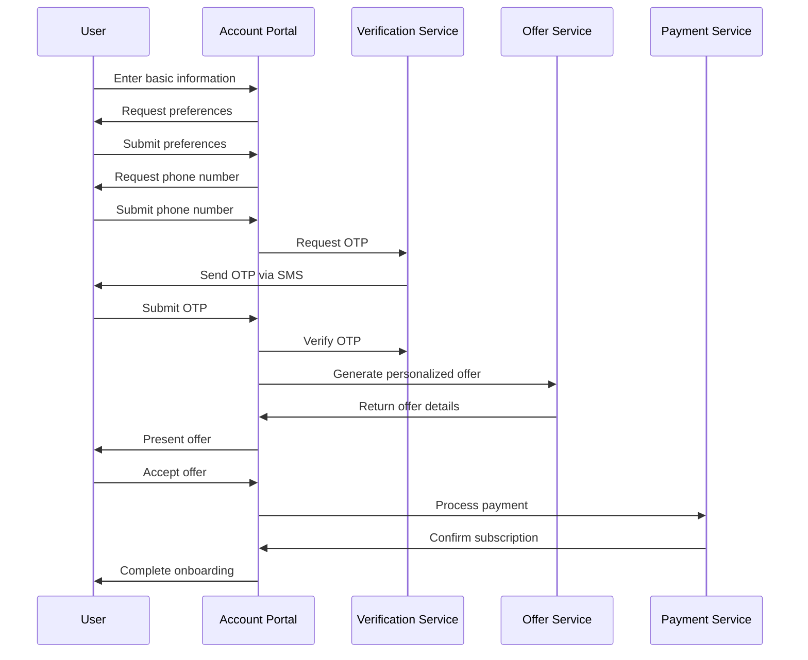
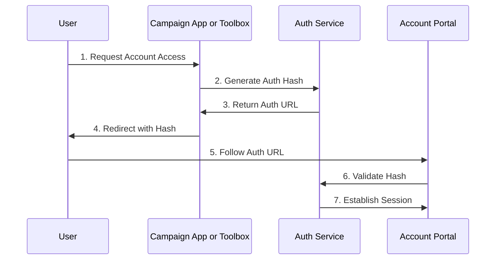

# Campaign Refinery Account Portal

A centralized platform for user account management, authentication, onboarding, and billing for Campaign Refinery's main application and Toolbox, serving both internal management and customers.

## Overview

The Account Portal provides a unified interface for managing user accounts, onboarding, authentication, billing, payment information, transaction history, and invoice access. It integrates directly with Campaign Refinery applications through a secure authentication mechanism and leverages Stripe for payment processing.

The Account Portal is primarily a user interface for clients and management. All transactions are logged by our current backend system and saved in Clickhouse. All subscription top-ups, credits removal, and cron jobs that create settlements and actual charges are handled by the current backend platform.

## Project Status (v1.0.11)

### Completed Features
- [x] Hash-based cross-service authentication
- [x] Auto-login process with secure hashes
- [x] Basic billing account model structure
- [x] Initial Stripe integration for payment processing
- [x] Journal interface concept for transaction history
- [x] Database schema for billing accounts and charges
- [x] Hierarchical billing account structure design
- [x] Migration of Stripe customer data into MySQL billing tables
- [x] Billing account creation for all user accounts
- [x] Payment method records created in database
- [x] Subscription management page (/billing) with current plan display
- [x] Subscription contract enforcement with `contract_ends_at` field
- [x] Associated accounts management interface (/billing/accounts)
- [x] Display of billing account information on user profile for owners
- [x] Hybrid storage implementation (MySQL for core data, Clickhouse for transactions)
- [x] Invoice generation and receipt access via Stripe's billing portal integration
- [x] Transaction history visualization (/billing/transactions)
- [x] Automatic and dynamic invoice generation
- [x] Credit purchase functionality with package options
- [x] Auto top-up settings configuration UI
- [x] Periodic settlement of credit usage
- [x] Daily overage usage charging
- [x] Webhooks for subscription and payment events
- [x] Payment method management (add/remove/set default)
- [x] Payment method selection flow for credit purchases
- [x] Admin settlement page with Stripe integration
- [x] Admin-only Stripe dashboard access
- [x] User profile management with secure updates
- [x] Email and phone verification systems
- [x] Enhanced settlement processing and logging
- [x] Optimized transaction and settlement queries
- [x] Refactored directory structure for better organization
  - [x] Consolidated billing operations in `/controllers/billing/`
  - [x] Moved Stripe webhooks to `/controllers/webhooks/`
  - [x] Added comprehensive docstrings and inline comments
- [x] Automatic top-ups based on user settings
- [x] Password verification for sensitive billing actions
- [x] Remaining webhook implementations
- [x] Complete integration with Core Email Service (both on account portal and service side)
- [x] Second level jobs support for the scheduler
- [x] Job for replenishing credits for accounts with irregular billing intervals
- [x] Application dockerization and production deployment
- [x] Unified logout experience across services
- [x] Ownership-based access control for billing features
  - [x] Restricted billing UI based on account ownership
  - [x] Adjusted account count display for non-owner accounts
  - [x] Simplified navigation and views for non-owners
- [x] User experience enhancements
  - [x] Display of all dates in the user's time zone
  - [x] Consistent date formatting across the application
  - [x] Lazy loading for images to improve performance
  - [x] Enhanced table row hover effects for better user experience
  - [x] Improved formatting of verification UI elements
- [x] Update settlements job to track current billing cycle usage of credits on a sub-account level basis
- [x] API Key Management
  - [x] Complete migration from core application to account portal
  - [x] User interface for creating, viewing, and revoking API keys
  - [x] Security features including hidden key display with reveal-on-demand
  - [x] Two-step confirmation for key revocation with visual feedback
  - [x] Responsive design for mobile and desktop
  - [x] Enhanced API key token generation with billing account ID for uniqueness
  - [x] Automatic API key creation for internal use upon customer creation
- [x] Application of sitewide design system
- [x] Add meta tags for Stripe checkouts to include the number of credits per subscription
- [x] Replace Twilio credentials with Campaign Refinery's accounts
- [x] Admin interface for credit management
  - [x] Admin-only credit adjustment functionality in the Usage controller
  - [x] Support for two credit allocation methods:
    - Waterfall/auto allocation (credits flow through subscription → prepaid → overage)
    - Manual allocation to specific credit buckets (subscription, prepaid, or overage)
  - [x] Validation to prevent removing more credits than allowed for no-overage accounts
    - Dynamic calculation of maximum credits that can be removed
    - Detailed error messages showing exact removal limits
  - [x] Integration with settlement system to record all credit adjustments
    - Settlement entries created for each adjustment
    - Billing account credit values updated in database
  - [x] Credit adjustment logging in ClickHouse for usage tracking
    - Using "adjust" reason code for filtering
    - Timestamp offset for proper historical sorting
  - [x] User-friendly success and error messages with actionable information
    - Confirmation of exact amount added/removed
    - Specification of affected credit bucket
    - Error codes (USG-02, USG-03) for troubleshooting
  - [x] Role-based access control for credit adjustment operations
  - [x] Account-specific filtering for viewing credit history
  - [x] Comprehensive form validation for credit adjustments
    - Zero-credit prevention
    - Credit amount format validation
    - Bucket type validation
- [x] Advanced filtering capabilities for reports
- [x] User registration and login system
- [x] Session management
- [x] Password reset functionality
- [x] Authorization middleware
- [x] Phone verification with OTP
- [x] Initial subscription setup
- [x] Comprehensive error handling
- [x] Performance optimization
  - [x] Optimized credit usage queries for improved performance
  - [x] Removed unnecessary ordering in usage queries
  - [x] Enhanced query execution for accurate total row calculations
  - [x] Implemented optimized ranked subqueries for better data retrieval performance
- [x] Security hardening
  - [x] User hash encryption for improved security
  - [x] Integer type casting for user IDs to improve data integrity
  - [x] Enhanced owner session management
- [x] Single sign-on experience across services
- [x] Sentry integration for error tracking and performance monitoring
  - [x] Enhanced admin alert notifications with severity flags
  - [x] Improved formatting of payload data in alert messages
- [x] Compliance with data protection regulations
- [x] Enhanced subscription management
  - [x] Adjusted credits for trialing subscriptions
  - [x] Refined billing account filtering to prevent incorrect matches
  - [x] Enhanced cancellation support for daily subscriptions
  - [x] Refactored subscription cancellation methods to use Stripe ID
  - [x] Improved calculation of billing cycle end dates for subscription cancellations
  - [x] Enhanced user feedback for subscription operations
- [x] Admin tooling improvements
  - [x] Enhanced Stripe dashboard integration with improved UI
  - [x] Added manual billing account and date range filtering for settlements
- [x] Agency relationship management
  - [x] Enhanced account unlink and delete functionality
  - [x] Email notifications for accounts unlinked from agency
  - [x] Authorization checks for billing account access
  - [x] Improved tooltips for account action buttons
- [x] UI/UX improvements
  - [x] Added tooltips styles and minified CSS for enhanced interaction
  - [x] Improved SVG icons for various email service providers
  - [x] Enhanced toast notifications for better user feedback
  - [x] Dynamic link styling based on active route
  - [x] Conditional formatting for phone numbers and other data
- [x] Support integration
  - [x] Helpscout Beacon integration for user identification and support tracking
- [x] Complete signup onboarding process
  - [x] Signup controller with form handling and validation
  - [x] Email verification with account activation
  - [x] One-time offer presentation
  - [x] Visual feedback for successful signup (confetti effect)
  - [x] Automatic billing account setup during registration
  - [x] API key creation for new accounts
  - [x] Support for various account types (Free, Business, Growth, Agency)
  - [x] Enhanced signup flow with new features section and success page
  - [x] Default UTC timezone setting for consistent user experience
- [x] Credit synchronization system
  - [x] Proper synchronization of credits between systems
  - [x] Enhanced queries using ranked subqueries for better performance
  - [x] Consistent crediting across subscription types
  - [x] Normalized billing account subscription names for consistency
- [x] Free credits allocation for new users during signup
  - [x] Implemented standardized credit pack values with APP_CREDIT_PACKS constant
  - [x] Automatic prepaid credit allocation for new users
  - [x] Settlement and transaction recording for all credit allocations
- [x] Enhanced error handling for Stripe API
  - [x] Admin alerts for critical Stripe API exceptions
  - [x] Improved Stripe session handling with better error feedback
  - [x] Cache clearing on successful Stripe events for data consistency
  - [x] Credit allocation logic improvements in Stripe webhooks

### In Progress Features
- [ ] Export functionality for usage reports
- [ ] Custom Mailgun API key integration (BYOK - Bring Your Own Key)
  - [ ] User interface for configuring custom Mailgun credentials
  - [ ] Secure storage and encryption of API keys
  - [ ] Validation system for key authenticity and permissions
  - [ ] Fallback mechanism if custom keys fail
- [ ] Enhanced subscription cancellation flow
  - [ ] Multi-step confirmation process with alternatives
  - [ ] Account hibernation option as alternative to cancellation
  - [ ] Retention incentives presentation
  - [ ] Cancellation reason collection and analytics

### Planned Features
- [ ] User preference collection
- [ ] Personalized offer generation
- [ ] White Label / Reseller Capabilities
- [ ] Advanced BYOK (Bring Your Own Key) functionality
  - [ ] Support for additional third-party services beyond Mailgun
  - [ ] Usage analytics for customer-provided infrastructure
  - [ ] Cost allocation tools for customer-owned services
- [ ] Affiliate Program
  - [ ] Unique referral link generation
  - [ ] Commission tracking and management
  - [ ] Affiliate dashboard with performance metrics
  - [ ] Automated commission payments
  - [ ] Multi-tier referral structure

## Technical Stack

- **Backend**: Tiny PHP framework
- **Frontend**: HTMX + Alpine.js
- **Payment Processing**: Stripe API (supporting card, bank, PayPal, and Link payment methods)
- **Authentication**: Hash-based URL authentication with dual session management
- **Data Storage**: MySQL for account data, Clickhouse for transaction history
- **SMS Provider**: Twilio for OTP verification (using Campaign Refinery's accounts)
- **Email Provider**: Mailgun (with support for customer-provided API keys)
- **Monitoring**: Sentry for error tracking and performance monitoring
- **Support**: Helpscout Beacon for user identification and support tracking
- **Containerization**: Docker with environment-specific configuration

## Core Features

- User Onboarding
- Authentication System
- Billing Account Management
- The Journal
- Stripe Integration
- Verification Service
- Infrastructure Flexibility (BYOK)
- Account Retention System
  - Enhanced cancellation flow
  - Account hibernation option
  - Personalized retention offers

## Architecture

### Component Diagram



### Database Schema

#### MySQL Tables

- `billing_accounts` - Primary billing entity table
  - Contains `owner_account_id` to determine account ownership
  - Stores comprehensive contact and address information
  - Tracks credit balances (subscription_credits, prepaid_credits, overage_credits, total_credits)
  - Manages Stripe integration via stripe_customer_id
  - Controls topup settings (topup_threshold, topup_amount, credit_cost_in_cents)
  - Manages overage allowance via allow_overage flag
  - Status tracking: active, inactive, delinquent, cancelled, suspended

- `billing_accounts_payment_methods` - Payment methods storage
  - Links to billing accounts via foreign key
  - Stores Stripe payment method IDs and card metadata
  - Supports multiple payment types (card, bank, paypal, link)
  - Tracks payment method status and default flag

- `billing_accounts_subscriptions` - Subscription management
  - Tracks subscription credits and Stripe subscription IDs
  - Manages billing cycles (day, week, month, year)
  - Enforces contracts via contract_ends_at date
  - Comprehensive status tracking: active, paused, canceled, past_due, pending

- `billing_accounts_transactions` - Financial transaction records
  - Links to billing accounts via foreign key
  - Tracks various Stripe IDs (customer, payment method, subscription, charge)
  - Supports multiple transaction types
  - Includes metadata via JSON field for flexible storage

- `billing_accounts_settlements` - Usage reconciliation
  - Tracks credit usage by type (subscription, prepaid, overage)
  - Maintains running credit balance
  - Status tracking: pending, completed, failed, error

- `api_credentials` - Storage for user-provided API keys
  - Links to billing accounts via foreign key
  - Stores encrypted third-party service credentials
  - Tracks provider type (mailgun, etc.)
  - Status tracking: active, inactive, verified, error
  - Secure storage with encryption for sensitive credentials

#### Clickhouse Tables

- `credit_usage_logs` - Credit usage tracking table
- `buffer_credit_usage_logs` - Buffer table for optimized writes
- `external_api_usage_logs` - Tracks usage of customer-provided API keys

## User Onboarding Flow



## Authentication Flow



## Development Setup

### Prerequisites

- PHP 8.3+
- Composer
- MySQL/MariaDB
- Stripe API credentials
- Twilio account for SMS verification

### Installation

1. Clone the repository:

   ```bash
   git clone https://github.com/campaign-refinery/account-portal.git
   cd account-portal
   ```

2. Initialize the Tiny framework submodule:

   ```bash
   git submodule update --init --recursive
   ```

3. Install dependencies:

   ```bash
   composer install
   ```

4. Set up environment variables:

   ```bash
   cp .env.example .env
   # Edit .env with your database, Stripe, and Twilio credentials
   ```

5. Run database migrations:

   ```bash
   php tiny migrate
   ```

6. Start the development server:

   ```bash
   php -S localhost:8000 -t public/
   ```

## Docker Setup

### Prerequisites

- Docker
- Docker Compose
- Git

### Installation with Docker

1. Clone the repository:
   ```bash
   git clone https://github.com/campaign-refinery/account-portal.git
   cd account-portal
   ```

2. Initialize the Tiny framework submodule:
   ```bash
   git submodule update --init --recursive
   ```

3. Set up environment variables:
   ```bash
   cp .env.local.example .env.local
   # Edit .env.local with your configuration
   ```

4. Start the Docker container:
   ```bash
   docker-compose up -d
   ```

5. Install dependencies:
   ```bash
   docker-compose exec app composer install
   ```

6. Run database migrations:
   ```bash
   docker-compose exec app php tiny migrate
   ```

7. Access the application:
   ```
   http://localhost:2345
   ```

### Production Deployment with Docker

The application has been successfully dockerized and deployed to production. The production setup includes:

- Optimized container configuration for performance and security
- Environment-specific configuration management
- Proper volume mounting for persistent data
- Integration with production services
- Enhanced PHP functionality through php84-pecl-excimer extension

### Development with Docker

- View logs:
  ```bash
  docker-compose logs -f app
  ```

- Access shell:
  ```bash
  docker-compose exec app sh
  ```

- Rebuild container after Dockerfile changes:
  ```bash
  docker-compose up -d --build
  ```

### Directory Mounting

The setup mounts these directories:
- Project root to `/var/www`
- `storage` directory for logs and uploads

## Integration Guide

### Campaign Refinery Integration

To integrate with the Campaign Refinery main application:

```php
// In Campaign Refinery application
class AccountController
{
    public function redirectToAccountPortal()
    {
        $userId = $_SESSION['account_id'];
        $timestamp = time();
        $secret = config('account_portal.secret');

        // Generate hash
        $payload = json_encode([
            'userId' => $userId,
            'origin' => 'campaign_refinery',
            'timestamp' => $timestamp
        ]);

        $hash = hash_hmac('sha256', $payload, $secret);

        // Redirect to account portal with hash
        header('Location: ' . config('account_portal.url') . '/auth/' . $hash);
        exit;
    }
}
```

### Toolbox Integration

Similar to Campaign Refinery integration, but with 'toolbox' as the origin.

### Core Email Service Integration

Integration with the Core Email Service is now complete, with authentication hashes enabling seamless navigation between the services:

```php
// In Core Email Service application
class AccountController
{
    public function redirectToAccountPortal()
    {
        $userId = $_SESSION['account_id'];
        $timestamp = time();
        $secret = config('account_portal.secret');

        // Generate hash
        $payload = json_encode([
            'userId' => $userId,
            'origin' => 'core_email_service',
            'timestamp' => $timestamp
        ]);

        $hash = hash_hmac('sha256', $payload, $secret);

        // Redirect to account portal with hash
        header('Location: ' . config('account_portal.url') . '/auth/' . $hash);
        exit;
    }
}
```

### Unified Logout Experience

The platform now supports a unified logout experience across integrated services:

```php
// In Account Portal
class AuthController
{
    public function logout()
    {
        // Clear local session
        session_destroy();

        // Determine origin service to redirect back to
        $origin = $_SESSION['origin'] ?? 'default';

        // Redirect to origin service logout endpoint with return hash
        $timestamp = time();
        $secret = config('auth.secret');

        $payload = json_encode([
            'userId' => $_SESSION['user_id'],
            'action' => 'logout',
            'timestamp' => $timestamp
        ]);

        $hash = hash_hmac('sha256', $payload, $secret);

        // Redirect to appropriate origin logout URL
        $logoutUrl = $this->getLogoutUrlForOrigin($origin, $hash);
        header('Location: ' . $logoutUrl);
        exit;
    }
}
```

## Backend Integration

The Account Portal UI interacts with the existing backend systems through:

1. **User Management**: Centralized user creation and authentication
2. **Transaction Data Display**: All transaction data is fetched from Clickhouse for display purposes
3. **Settlement Processing**: The backend handles all settlement creation and processing
4. **Charge Management**: The backend system manages all subscription top-ups, credits, and actual charges
5. **Stripe Event Handling**: Payment events from Stripe are processed by the backend system

## Security Considerations

- All authentication hashes expire after 5 minutes
- OTP verification for new account registration
- CSRF protection on all forms
- Rate limiting on authentication endpoints
- Input validation and sanitization
- XSS protection via proper output escaping
- Session security with HTTP-only cookies
- Role-based access control with ownership validation for billing features
- Billing feature access restricted to billing account owners only
- Non-owner accounts receive limited access with appropriate UI guidance
- Improved redirect logic for handling missing query parameters securely
- Enhanced webhook validation with proper error handling

## License

Proprietary - Copyright © 2025 Campaign Refinery
